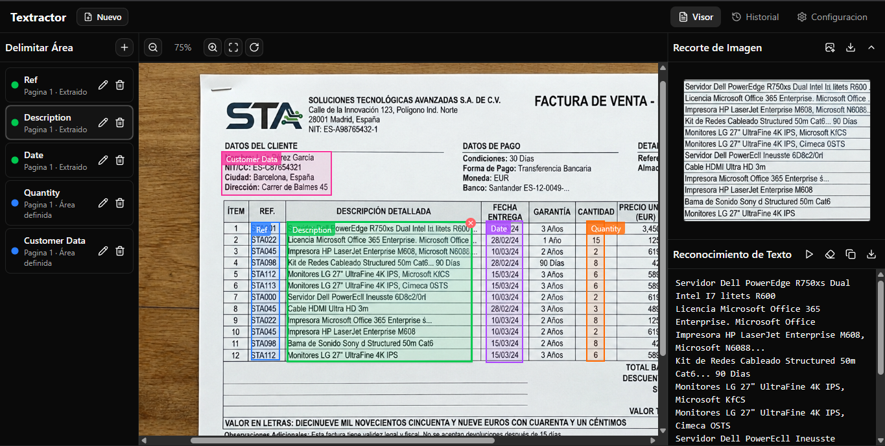
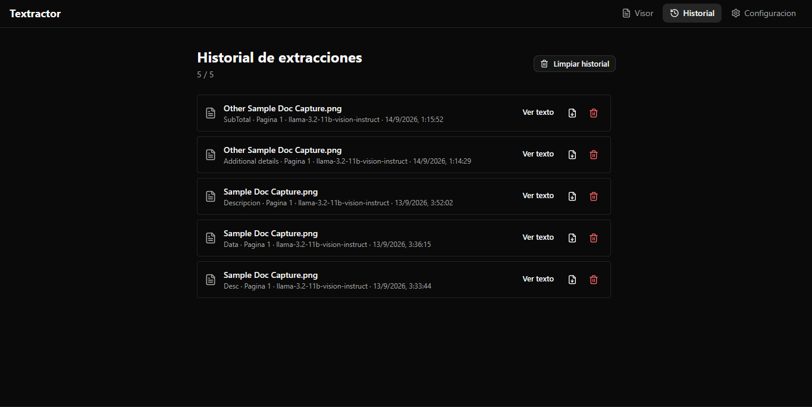
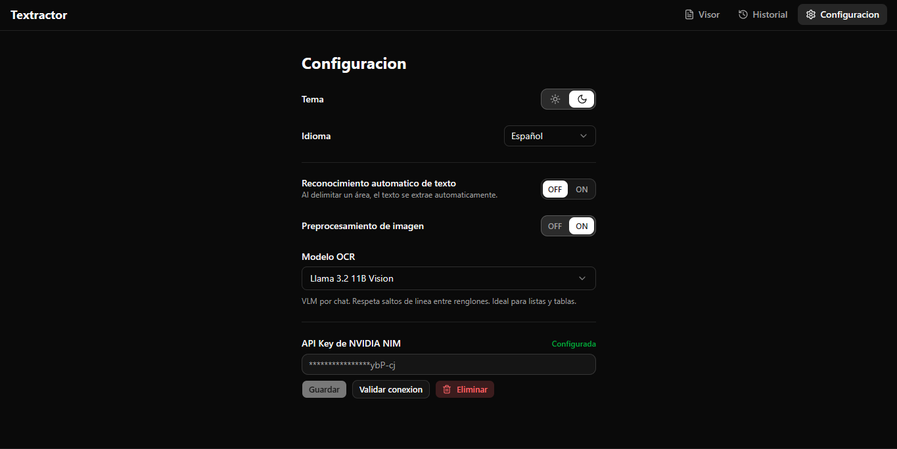
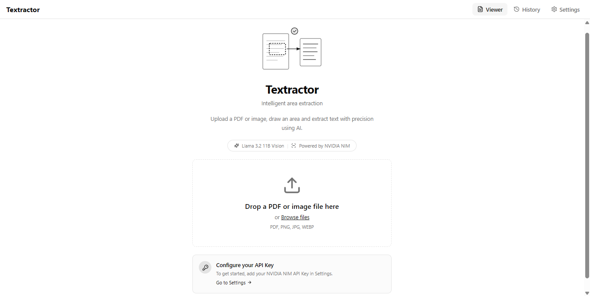
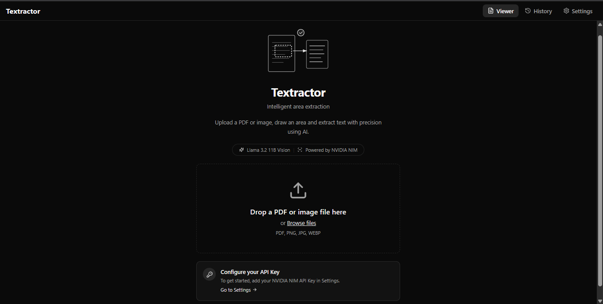

<div align="center">

# Textractor

**Intelligent text extraction from PDFs and images using AI-powered OCR**

[](#espanol)
[](#english)

</div>

> **Available languages:** [English](#english) · [Español](#espanol)

---

<a id="english"></a>

## 🇬🇧 English

### About

Textractor is a **local-first web application** for extracting text from specific areas of PDF documents and images using AI-powered OCR.

Open a file, draw a rectangle over the area you care about, and Textractor crops that zone and runs OCR on it — keeping every extraction organized in **Areas**, with line breaks and visual order preserved (great for lists and tables). You pick the engine from Settings: **Nemotron OCR v2** (fast specialized OCR), **Llama 3.2 11B Vision** (default; line-faithful chat transcription) or **Nemotron Parse** (document parsing) — all served through **NVIDIA NIM** and routed by the local backend.

### Local by design

- The entire app runs on your machine: a Vite frontend and an Express backend, both bound to `localhost`.
- **Documents, extracted text, history, settings and your API key never leave your device** — they are stored in a local SQLite database and `localStorage`. No accounts, no cloud storage, no telemetry.
- The one exception is the OCR request itself: the image crop of the area you extract is sent over HTTPS to the NVIDIA NIM endpoint for transcription, together with your API key. That is what cloud OCR is; nothing else is uploaded.

### Features

- 📄 **Document viewer** for PDF and images (PNG, JPG, WEBP): multi-page navigation, zoom & pan, page rotation, resizable panels
- ✂️ **Interactive area selection**: drag to draw, rename, delete a zone right from its corner
- 🤖 **OCR via NVIDIA NIM** with model choice, optional image preprocessing and **automatic recognition** mode that extracts text as soon as you define an area
- 📑 **Line-structure preservation** — extracted lists and tables keep their rows
- 🕓 **History** of every extraction with the model used, record viewing, copy, `.txt` download and per-record delete
- 🔑 **Bring your own API key**: set it from the Settings page (stored in local SQLite, shown masked, with a built-in connection validator) or via `.env` — a user-configured key takes precedence
- 🌗 **Light and dark themes** · 🌍 **Bilingual UI** (Spanish / English) that persists across reloads
- 📴 **Offline-aware**: detects a missing internet connection and reports it in plain language
- ⌨️ **Keyboard accessible** controls and labeled actions throughout

### Screenshots

**Viewer — areas drawn, crop preview and OCR result with preserved lines:**



| History | Settings |
| :---: | :---: |
|  |  |

| Home (light) | Home (dark) |
| :---: | :---: |
|  |  |

### Tech Stack

**Frontend** (`packages/web`)
- React 19 · Vite 6 · TypeScript 5
- Tailwind CSS 4 · shadcn/ui (Base UI)
- Zustand (state) · react-router-dom 7
- react-i18next (i18n) · pdfjs-dist

**Backend** (`packages/api`)
- Node.js · Express 4 · TypeScript 5
- better-sqlite3 v13 — history and settings persistence, versioned migrations, graceful shutdown
- 43 unit tests (Vitest on the web package, `node:test` on the API)

**OCR**
- NVIDIA NIM hosted models: `nvidia/nemotron-ocr-v2` (CV endpoint), `meta/llama-3.2-11b-vision-instruct` (chat endpoint, default), `nvidia/nemotron-parse` — proxied through the local backend

### System Requirements

**Required**
- **Node.js ≥ 22** (24 recommended) — the `better-sqlite3` v13 native binding needs Node 22+
- **pnpm ≥ 11** — the workspace relies on v11 settings (`allowBuilds`, `minimumReleaseAge`, `trustPolicy`); the lockfile is supply-chain checked on every install
- An **NVIDIA API key** (free from [build.nvidia.com](https://build.nvidia.com)) with access to the models you want to use

> ⚠️ NVIDIA occasionally retires hosted model versions. Textractor shows a clear, localized message when that happens and you can switch models in Settings — no broken UI.

**Only if prebuilt binaries are not available for your platform**
- Windows: **MSVC Build Tools** (Visual Studio Build Tools with the "Desktop development with C++" workload)
- macOS: **Xcode Command Line Tools** (`xcode-select --install`)
- Linux: **build-essential** (`gcc`, `g++`, `make`) and **Python 3**
- These are only needed as a fallback for `better-sqlite3` (and similar native modules) when no prebuilt `.node` binary is published for your OS / architecture / Node version. On mainstream platforms (Windows x64, macOS x64/arm64, Linux x64/arm64) with a current Node LTS, **no compilation is usually required**.

### Installation

```bash
# 1. Clone the repository
git clone https://github.com/andrecch/textractor.git
cd textractor

# 2. Install dependencies
pnpm install

# 3. (Optional) Configure a server-side API key
cp .env.example .env
# Edit .env and add your NVIDIA API key:
#   NVIDIA_API_KEY=nvapi-...
# You can also skip this and paste the key inside the app's Settings page;
# a user key stored via the UI takes precedence over .env.

# 4. Start the dev servers (web + api in parallel)
pnpm dev
```

After starting:

- Frontend: <http://localhost:5173>
- Backend: <http://localhost:3001>

Vite automatically proxies `/api/*` requests to the backend.

### Available Scripts

| Script | Description |
| --- | --- |
| `pnpm dev` | Starts web (Vite) and API (tsx watch) in parallel |
| `pnpm dev:web` | Starts only the frontend |
| `pnpm dev:api` | Starts only the backend |
| `pnpm build` | Production build of both packages |
| `pnpm build:web` | Build only the frontend |
| `pnpm build:api` | Build only the backend |
| `pnpm -r test` | Run unit tests on both packages |
| `pnpm lint` | Run ESLint on both packages |

### Quick Usage

1. Open the app and **load a PDF or image** (file picker, drag & drop, or keyboard).
2. The first **Area** is created automatically — rename it if you want.
3. **Draw a rectangle** over the region you need. With *automatic recognition* enabled, extraction starts on its own; otherwise press **Extract**.
4. Review the result, then **copy** it or **export** it as `.txt`; download the crop if you need the image.
5. Add more areas for other parts of the document.
6. Every run is logged in **History** with its model — you can re-read, download or delete individual records.

### Project Structure

```
textractor/
├── packages/
│   ├── web/          # React + Vite frontend
│   └── api/          # Express backend + SQLite
├── docs/             # PRD, architecture, plans, screenshots
├── .env.example      # Environment variables template
└── package.json      # Root workspace config
```

For deeper details, see [`docs/PRD.md`](docs/PRD.md) and [`docs/ARCHITECTURE.md`](docs/ARCHITECTURE.md).

---

<a id="espanol"></a>

## 🇪🇸 Español

### Acerca de

Textractor es una **aplicación web de ejecución local** para extraer texto de zonas específicas de documentos PDF e imágenes usando OCR con IA.

Abre un archivo, dibuja un rectángulo sobre la zona que te interesa, y Textractor recorta esa área y ejecuta OCR sobre ella — manteniendo cada extracción organizada en **Áreas**, con saltos de línea y orden visual preservados (ideal para listas y tablas). Eliges el motor desde Configuración: **Nemotron OCR v2** (OCR especializado y rápido), **Llama 3.2 11B Vision** (por defecto; transcripción por chat que respeta renglones) o **Nemotron Parse** (parseo de documentos) — todos servidos a través de **NVIDIA NIM** y enrutados por el backend local.

### Diseño local

- Toda la app corre en tu máquina: un frontend Vite y un backend Express, ambos ligados a `localhost`.
- **Los documentos, el texto extraído, el historial, la configuración y tu API key nunca salen de tu equipo** — se guardan en una base de datos SQLite local y en `localStorage`. Sin cuentas, sin nube, sin telemetría.
- La única excepción es la petición de OCR en sí: el recorte de la zona que extraes viaja por HTTPS al endpoint de NVIDIA NIM para su transcripción, junto con tu API key. Así funciona el OCR en la nube; nada más se envía.

### Características

- 📄 **Visor de documentos** PDF e imágenes (PNG, JPG, WEBP): navegación multipágina, zoom y desplazamiento, rotación de página, paneles redimensionables
- ✂️ **Selección interactiva de áreas**: dibuja arrastrando, renombra, elimina una zona desde su propia esquina
- 🤖 **OCR con NVIDIA NIM** con selector de modelo, preprocesamiento de imagen opcional y modo de **reconocimiento automático** que extrae el texto al delimitar el área
- 📑 **Preservación de la estructura de líneas** — listas y tablas mantienen sus renglones al extraer
- 🕓 **Historial** de todas las extracciones con el modelo usado, vista del texto, copiado, descarga `.txt` y borrado registro a registro
- 🔑 **API key propia**: configúrala desde la página de Configuración (se guarda en SQLite local, se muestra enmascarada y tiene validador de conexión integrado) o vía `.env` — la clave del usuario tiene prioridad sobre `.env`
- 🌗 **Temas claro y oscuro** · 🌍 **Interfaz bilingüe** (Español / Inglés) que persiste al recargar
- 📴 **Consciente de la desconexión**: detecta la falta de internet y lo reporta en claro
- ⌨️ **Accesible por teclado**: controles operables y acciones etiquetadas en toda la app

### Capturas de pantalla

**Visor — áreas dibujadas, vista previa del recorte y resultado OCR con líneas preservadas:**


| Historial | Configuración |
| :---: | :---: |
|  |  |

| Inicio (claro) | Inicio (oscuro) |
| :---: | :---: |
|  |  |

### Stack Tecnológico

**Frontend** (`packages/web`)
- React 19 · Vite 6 · TypeScript 5
- Tailwind CSS 4 · shadcn/ui (Base UI)
- Zustand (estado) · react-router-dom 7
- react-i18next (i18n) · pdfjs-dist

**Backend** (`packages/api`)
- Node.js · Express 4 · TypeScript 5
- better-sqlite3 v13 — persistencia de historial y ajustes, migraciones versionadas, apagado seguro
- 43 pruebas unitarias (Vitest en el paquete web, `node:test` en la API)

**OCR**
- Modelos alojados en NVIDIA NIM: `nvidia/nemotron-ocr-v2` (endpoint CV), `meta/llama-3.2-11b-vision-instruct` (endpoint de chat, por defecto), `nvidia/nemotron-parse` — proxificados por el backend local

### Requisitos del sistema

**Obligatorios**
- **Node.js ≥ 22** (recomendado 24) — el binding nativo de `better-sqlite3` v13 requiere Node 22+
- **pnpm ≥ 11** — el workspace usa ajustes de v11 (`allowBuilds`, `minimumReleaseAge`, `trustPolicy`); el lockfile se verifica contra políticas de cadena de suministro en cada instalación
- Una **API key de NVIDIA** (gratuita en [build.nvidia.com](https://build.nvidia.com)) con acceso a los modelos que quieras usar

> ⚠️ NVIDIA retira versiones alojadas de vez en cuando. Textractor muestra un mensaje claro y localizado cuando eso ocurre y puedes cambiar de modelo desde Configuración — sin interfaces rotas.

**Solo si los prebuilt binaries no están disponibles para tu plataforma**
- Windows: **MSVC Build Tools** (Visual Studio Build Tools con la carga de trabajo "Desarrollo para escritorio con C++")
- macOS: **Xcode Command Line Tools** (`xcode-select --install`)
- Linux: **build-essential** (`gcc`, `g++`, `make`) y **Python 3**
- Esto solo se necesita como fallback para `better-sqlite3` (y módulos nativos similares) cuando no exista un binario precompilado `.node` para tu SO / arquitectura / versión de Node. En plataformas comunes (Windows x64, macOS x64/arm64, Linux x64/arm64) con un Node LTS actual, **normalmente no se requiere compilar nada**.

### Instalación

```bash
# 1. Clonar el repositorio
git clone https://github.com/andrecch/textractor.git
cd textractor

# 2. Instalar dependencias
pnpm install

# 3. (Opcional) Configurar una API key del servidor
cp .env.example .env
# Edita .env y agrega tu API key de NVIDIA:
#   NVIDIA_API_KEY=nvapi-...
# También puedes saltarte este paso y pegar la clave dentro de la app en Configuración;
# la clave de usuario guardada desde la UI tiene prioridad sobre .env.

# 4. Iniciar los servidores de desarrollo (web + api en paralelo)
pnpm dev
```

Una vez iniciado:

- Frontend: <http://localhost:5173>
- Backend: <http://localhost:3001>

Vite redirige automáticamente las peticiones `/api/*` al backend.

### Scripts disponibles

| Script | Descripción |
| --- | --- |
| `pnpm dev` | Inicia web (Vite) y API (tsx watch) en paralelo |
| `pnpm dev:web` | Inicia solo el frontend |
| `pnpm dev:api` | Inicia solo el backend |
| `pnpm build` | Build de producción de ambos paquetes |
| `pnpm build:web` | Build solo del frontend |
| `pnpm build:api` | Build solo del backend |
| `pnpm -r test` | Ejecuta las pruebas unitarias de ambos paquetes |
| `pnpm lint` | Ejecuta ESLint en ambos paquetes |

### Uso rápido

1. Abre la app y **carga un PDF o imagen** (selector de archivos, drag & drop o teclado).
2. La primera **Área** se crea automáticamente — cámbiale el nombre si lo deseas.
3. **Dibuja un rectángulo** sobre la zona que necesitas. Con el *reconocimiento automático* activado, la extracción empieza sola; si no, pulsa **Extraer**.
4. Revisa el resultado, luego **cópialo** o **expórtalo** como `.txt`; descarga el recorte si necesitas la imagen.
5. Agrega más áreas para otras partes del documento.
6. Cada ejecución queda registrada en el **Historial** con su modelo — puedes releer, descargar o borrar registros individuales.

### Estructura del proyecto

```
textractor/
├── packages/
│   ├── web/          # Frontend React + Vite
│   └── api/          # Backend Express + SQLite
├── docs/             # PRD, arquitectura, planes, capturas
├── .env.example      # Plantilla de variables de entorno
└── package.json      # Configuración de workspaces raíz
```

Para más detalle, consulta [`docs/PRD.md`](docs/PRD.md) y [`docs/ARCHITECTURE.md`](docs/ARCHITECTURE.md).
